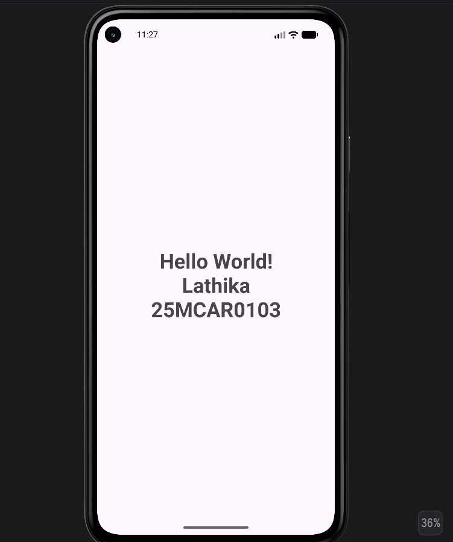

# Android Hello World Application

## Experiment 1: Hello World Android Application

### Aim

To develop a simple Android application that displays the message **"Hello World!"** using a TextView.

---

## Objective

- Learn the basic structure of an Android application.
- Design a simple user interface using XML.
- Display text using a TextView.
- Run the application on an Android Emulator.

---

## Technologies Used

- Android Studio
- Kotlin
- XML
- Android SDK
- Gradle

---

## Concept

Android applications are built using **Activities** and **XML layout files**.

- **MainActivity.kt** is the entry point of the application.
- **activity_main.xml** is used to design the user interface.
- **TextView** is used to display text on the screen.
- The application is executed using an Android Emulator.

---

## Scenario

A simple Android application is developed to display the message **"Hello World!"** at the center of the screen. The application demonstrates the basic Android project structure and the use of a TextView for displaying text.

---

# Project Folder Structure

```text
Android-HelloWorld/
│
├── app/
│   ├── src/
│   │   ├── main/
│   │   │   ├── java/
│   │   │   │   └── MainActivity.kt
│   │   │   ├── res/
│   │   │   │   ├── layout/
│   │   │   │   │   └── activity_main.xml
│   │   │   │   └── values/
│   │   │   │       └── strings.xml
│   │   │   └── AndroidManifest.xml
│
├── Screenshot/
│   ├── output.png
│   ├── testcase1.png
│   └── testcase3.png
│
├── README.md
├── build.gradle.kts
└── settings.gradle.kts
```

---

# Output

The application displays the following message:

**Hello World!**

### Output Screenshot


---

# Test Cases

## Test Case 1

**Test Case ID:** TC-01

**Objective:** Verify that the application launches successfully.

**Input:**
Launch the application.

**Expected Result:**
The application opens successfully and displays **Hello World!**

**Actual Result:**
Pass

**Screenshot:**


---

## Test Case 2

**Test Case ID:** TC-02

**Objective:** Verify that the application continues to display the message after reopening.

**Input:**
Close the application and launch it again.

**Expected Result:**
The application displays **Hello World!**

**Actual Result:**
Pass

**Screenshot:**


---

## Test Case 3

**Test Case ID:** TC-03

**Objective:** Verify that the application displays the student's Name and USN.

**Input:**
Modify the TextView to display the student's Name and USN.

**Expected Result:**

```text
Hello World!

Lathika

25MCAR0103
```

**Actual Result:**
Pass

**Screenshot:**



---

# Conclusion

The experiment was successfully completed by developing a simple Android application using Android Studio. The application successfully displays the **"Hello World!"** message using a TextView and demonstrates the basic Android project structure, XML layout design, and application execution on an Android Emulator.

---

# Author

**Name:** Lathika

**USN:** 25MCAR0103

**Course:** MCA

**Subject:** Android Application Development
